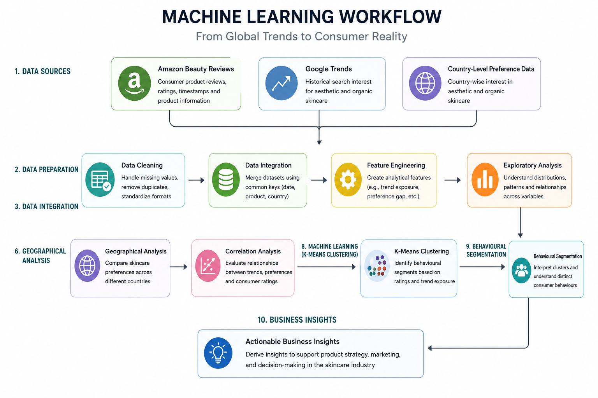
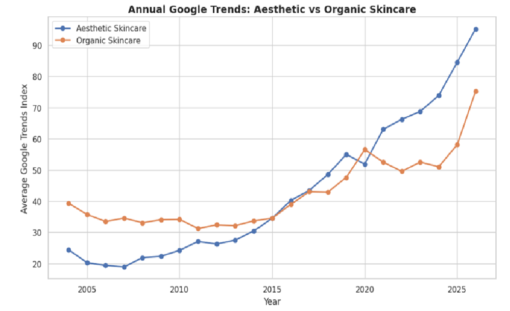
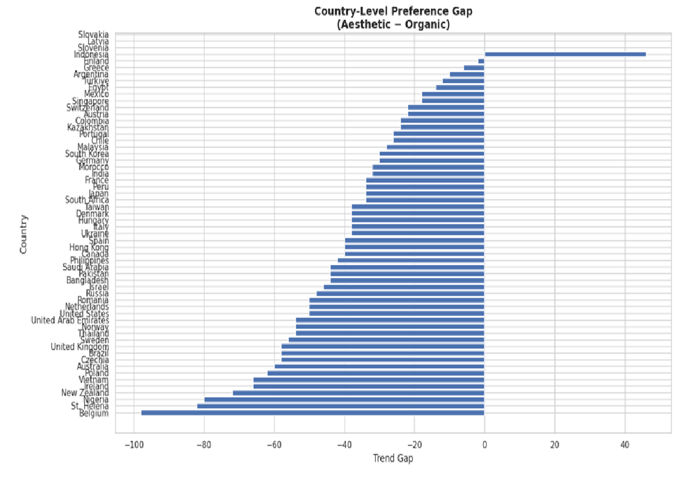
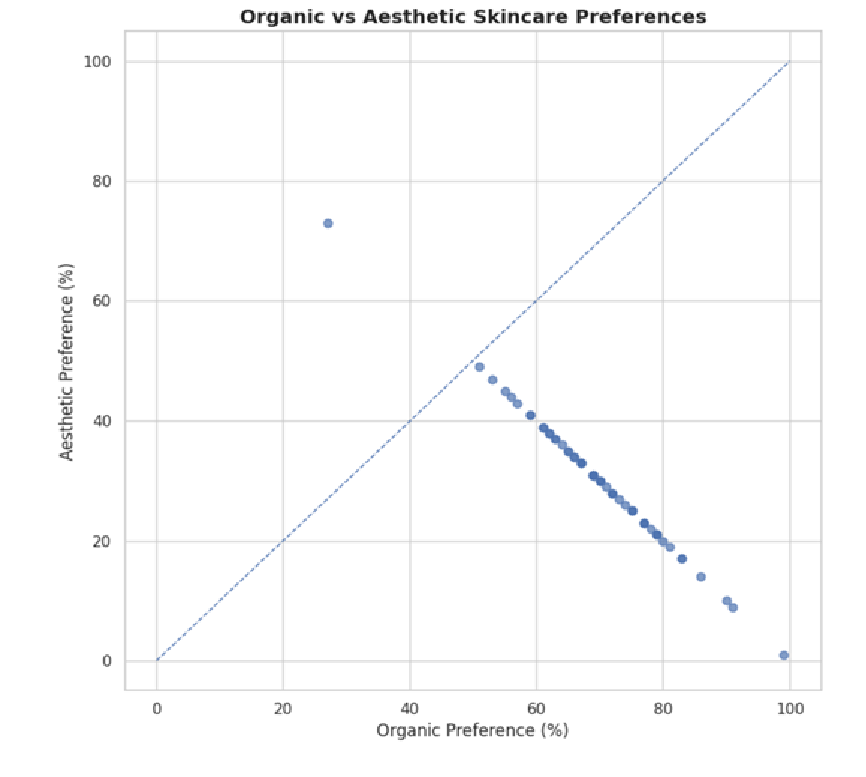
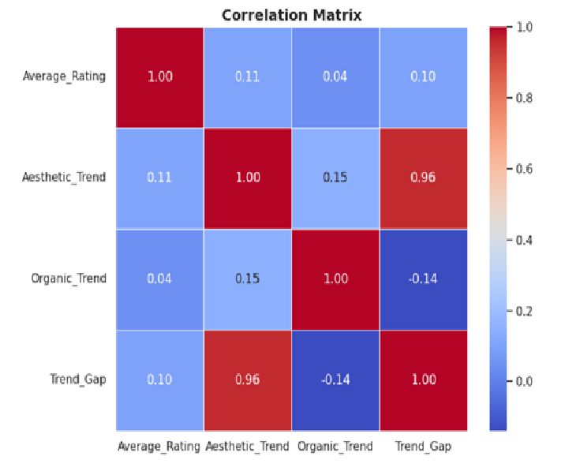
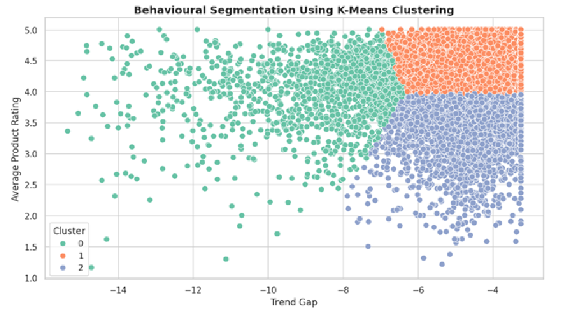

# From Global Trends to Consumer Reality

## Uncovering Hidden Patterns in Skincare Behavior through Data-Driven Segmentation

<p align="center">
  
  
  
  
  
</p>

An end-to-end Machine Learning and Consumer Analytics project that investigates the relationship between global skincare trends and real consumer behaviour by integrating Amazon Beauty Reviews, Google Trends, and country-level preference data.

The project combines data preprocessing, feature engineering, exploratory data analysis, geographical analytics, statistical analysis, and K-Means clustering to uncover hidden consumer behaviour patterns and generate actionable business insights.

---

## Machine Learning Workflow

<p align="center">

</p>

---

# Project Highlights

- Integrated three independent real-world datasets into a unified analytical framework.
- Engineered analytical features to connect consumer reviews with global search trends.
- Performed temporal, geographical, and statistical analysis.
- Applied K-Means clustering for behavioural segmentation.
- Generated business insights through data-driven consumer analytics.
- Built an end-to-end reproducible Machine Learning workflow.

---

# Business Problem

Businesses frequently monitor online search trends to understand changing consumer interests. However, increasing search popularity does not necessarily translate into improved customer satisfaction or purchasing behaviour.

This project investigates whether:

- Global skincare trends influence consumer ratings.
- Consumer preferences differ across geographical regions.
- Hidden behavioural segments exist among products exposed to similar trend conditions.

---

# Project Objectives

- Integrate multiple consumer-related datasets.
- Analyse global skincare trends over time.
- Compare country-level skincare preferences.
- Explore relationships between search trends and consumer ratings.
- Identify hidden behavioural segments using Machine Learning.
- Generate actionable business insights from integrated data.

---

# Datasets

| Dataset | Purpose |
|----------|----------|
| Amazon Beauty Reviews | Consumer ratings, product information and review history |
| Google Trends | Global search interest for aesthetic and organic skincare |
| Country-Level Preference Data | Country-wise skincare preference analysis |

---

# Technologies Used

| Category | Technologies |
|----------|--------------|
| Programming | Python |
| Data Processing | Pandas, NumPy |
| Data Visualisation | Matplotlib, Seaborn |
| Machine Learning | Scikit-learn |
| Statistical Analysis | SciPy |
| Development Environment | Jupyter Notebook |

---

# Repository Structure

```text
skincare-behavior-segmentation/

│── README.md
│── LICENSE
│── requirements.txt
│── .gitignore

├── notebook/
│   └── skincare_behavior_segmentation.ipynb

├── report/
│   └── Skincare_Behavior_Segmentation_Report.pdf

├── results/
│   ├── workflow.png
│   ├── temporal_trend_analysis.png
│   ├── country_preference_gap.png
│   ├── country_distribution_scatter.png
│   ├── correlation_heatmap.png
│   └── kmeans_clusters.png

└── data/
    └── data_sources.md
```

---

# Results

## 1. Temporal Trend Analysis

<p align="center">

</p>

The temporal analysis illustrates how global interest in aesthetic and organic skincare evolved over time, providing the temporal context for subsequent behavioural analysis.

---

## 2. Geographical Preference Analysis

<p align="center">

</p>

Country-level analysis highlights substantial geographical variation in skincare preferences, demonstrating that consumer interests differ considerably across international markets.

---

## 3. Country-Level Distribution Analysis

<p align="center">

</p>

The scatter plot compares aesthetic and organic skincare preferences across countries, revealing regional variability and balanced market segments.

---

## 4. Correlation Analysis

<p align="center">

</p>

Correlation analysis indicates only weak relationships between global skincare trends and consumer ratings, suggesting that consumer behaviour is influenced by additional factors beyond search popularity.

---

## 5. Behavioural Segmentation using K-Means

<p align="center">

</p>

K-Means clustering identified distinct behavioural segments based on product ratings and trend exposure, demonstrating that products exposed to similar market trends can receive different levels of consumer satisfaction.

---

# Key Findings

- Global skincare trends alone do not explain consumer satisfaction.
- Organic skincare attracts stronger interest across most countries analysed.
- Consumer behaviour varies significantly between geographical regions.
- Hidden behavioural segments emerge despite similar market conditions.
- Integrating multiple datasets provides richer consumer insights than analysing individual data sources independently.

---

# Future Improvements

Potential extensions of this project include:

- Incorporating product price and brand information.
- Applying Natural Language Processing (NLP) to review text.
- Exploring advanced clustering techniques such as DBSCAN and Hierarchical Clustering.
- Developing recommendation systems based on behavioural segments.
- Expanding geographical analysis using regional or city-level data.

---

# Installation

Clone the repository

```bash
git clone https://github.com/YOUR_USERNAME/skincare-behavior-segmentation.git
```

Install the required libraries

```bash
pip install -r requirements.txt
```

Launch Jupyter Notebook

```bash
jupyter notebook
```

Open

```text
notebook/skincare_behavior_segmentation.ipynb
```

---

# Author

**Anum Ahmed**

**MSc Data Analytics**

Machine Learning • Consumer Analytics • Data Visualisation • Behavioural Analytics

This project forms part of a professional Machine Learning portfolio demonstrating end-to-end consumer analytics, feature engineering, statistical analysis, and unsupervised learning.

---

# License

This project is licensed under the MIT License.
